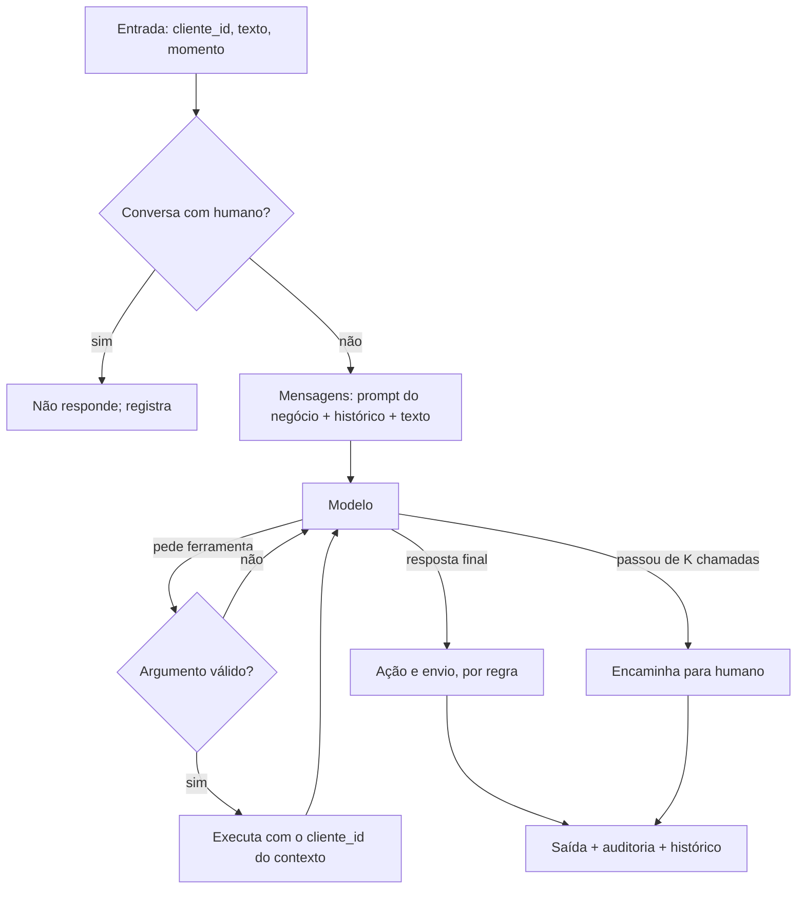

# Plano da spec 001

> **Rascunho v0, 08/10/2026.** O "como" da [spec](spec.md). Muda quando a spec mudar.
> ⟪Dn⟫ marca decisão sua (seção 2). *(minha)* marca escolha minha, com a saída ao lado. **F** = Fernando, **C** =
> Claude, conforme a divisão da seção 9 da spec. Fatos de provedor conferidos nas páginas oficiais em 08/10/2026.

## 1. Stack

- **Python 3.12 com `uv`.** `requirements.txt` (o que roda) e `requirements-dev.txt` (`pytest`, `ruff`), como no
  `rag_do_zero`
- **SDK `openai` (3.x) como cliente único.** Groq e Gemini aceitam o formato da OpenAI; muda só `base_url`, chave e
  parâmetros de raciocínio, e isso fica em configuração. É SDK de provedor, não framework de agente (RS-12)
- **`pydantic` v2** para o contrato e para os argumentos de cada ferramenta. O mesmo modelo pydantic gera o JSON
  Schema enviado ao modelo e valida o argumento que volta: um registro só (RF-11)
- **`rapidfuzz` + `unicodedata`** para a busca tolerante a acento e erro de digitação (RF-14) *(minha)*
- **`fastembed`** com `paraphrase-multilingual-MiniLM-L12-v2`, na CPU, importado só na hora de usar, como no
  `rag_do_zero` ⟪D3⟫
- **`sqlite3`** da biblioteca padrão para histórico, estado "com humano" e fila de encaminhamento, em
  `outputs/estado.sqlite3` *(minha; saída: um JSON por cliente, se o SQLite atrapalhar)*
- **`pyyaml`** para tudo que se escreve à mão: negócio, modelos, casos *(minha)*
- **`argparse`** para a linha de comando *(minha: sem dependência; `typer` se a CLI crescer)*
- **`python-dotenv`** para ler o `.env`
- **Rede:** o `/etc/gai.conf` já prefere IPv4 (conferido em 08/10), então, ao contrário da legaltech, não é preciso
  forçar IPv4 no código

## 2. Decisões a confirmar

| | Decisão | Proposta | Por quê |
|---|---|---|---|
| **D1** | Modelos | **Groq `qwen/qwen3.8-27b`** no dia a dia; **Gemini `gemini-3.5-flash-lite`** na comparação (CA-05) | Na Groq, os `gpt-oss` **não fazem chamadas paralelas** (RF-08); o Qwen faz. Os limites da Groq são publicados; os do Gemini só aparecem no AI Studio, e a compatibilidade dele com o formato da OpenAI ainda é **beta**. A preço pago, o Flash-Lite é o mais barato dos dois (US$ 0,30 / 2,50 por milhão de tokens de entrada / saída, contra ~US$ 0,80 / 4,00 do Qwen): pode ser ele o modelo da proposta ao cliente |
| **D2** | Como o núcleo sabe que recusou | Uma **quinta ferramenta, `recusar(motivo)`**, com `motivo` entre `fora_do_escopo`, `sem_evidencia` e `instrucao_suspeita`. **Muda a spec**, que hoje tem quatro | A RF-02 pede `acao`, mas a resposta final do modelo é texto. "Encaminhar" se deduz (chamou `chamar_humano` ou passou do K); "recusar", não. Como ferramenta, a recusa vira chamada medida pelo mesmo gate. Alternativas piores: resposta final em JSON (frágil junto com ferramentas, e beta no Gemini) ou classificar a resposta depois (outra chamada, e erra) |
| **D3** | Embeddings | **Locais**, com `fastembed` | Custo zero, nada sai da máquina, não disputa o limite por minuto com o chat, e você já conhece o modelo, inclusive o corte em 128 tokens (~60 palavras em português). Por isso cada trecho é uma pergunta frequente com a resposta, curto |

## 3. Estrutura

```
agente-whatsapp/
├── specs/001-nucleo/          spec.md, plan.md, depois tasks.md
├── config/modelos.yaml        provedor, id, chave, raciocínio, limites, preço pago, fonte      C
├── negocios/
│   ├── pet-shop/              negocio.yaml, catalogo.csv, pedidos.json, clientes.csv,
│   │                          documentos/*.md (rascunho C, revisão F)                         C
│   └── minimo/                o segundo negócio da CA-06                                      C
├── avaliacao/casos.yaml       os casos (RF-26, RF-27)                                         F
├── src/agente/
│   ├── nucleo/                sem canal (RS-01)
│   │   ├── contrato.py        Entrada, Saida (RF-01, RF-02)                                   F
│   │   ├── agente.py          o laço (RF-07 a RF-10)                                          F
│   │   ├── prompt.py          prompt do sistema a partir da pasta do negócio (RF-18 a RF-22)  F
│   │   ├── politica.py        autonomia (RF-23)                                               F
│   │   ├── historico.py       histórico e estado "com humano" (RF-03, RF-04)                  F
│   │   ├── ferramentas/       registro.py (RF-11); produto, pedido, documentos, humano        F
│   │   └── modelo/            base.py (interface), openai_compat.py (RF-12, RF-13)            F
│   │                          falso.py (roteirizado, RS-07)                                   C
│   ├── dados/                 negocio.py, fonte.py, indice.py (RF-05, RF-06, embeddings)      C
│   ├── auditoria.py           RF-24                                                           C
│   ├── custo.py               RF-25                                                           C
│   ├── avaliacao/             executor, métricas, checagem de fatos, relatório (RF-28 a 30)  C
│   └── cli.py                 chat, gate e diagnóstico (RF-32)                                C
├── scripts/gerar_dados.py     semente fixa (RF-31)                                            C
├── tests/
├── logs/                      fora do git: auditoria.jsonl
└── outputs/                   fora do git: estado.sqlite3, relatorios/
```

Formato de `config/modelos.yaml` (preenchido na P0):

```yaml
groq-qwen:
  base_url: https://api.groq.com/openai/v1
  modelo: qwen/qwen3.8-27b
  chave_env: GROQ_API_KEY
  extra: {reasoning_effort: low, reasoning_format: hidden}
  limites: {req_min: 30, req_dia: 1000, tokens_min: 8000, tokens_dia: 200000}
  preco_pago_usd_milhao: {entrada: 0.80, saida: 4.00}
  fonte: console.groq.com, 08/10/2026
gemini-flash-lite:
  base_url: https://generativelanguage.googleapis.com/v1beta/openai/
  modelo: gemini-3.5-flash-lite
  chave_env: GEMINI_API_KEY
  extra: {reasoning_effort: minimal}
  limites: {}          # o Google não publica; copiar do AI Studio
  preco_pago_usd_milhao: {entrada: 0.30, saida: 2.50}
  fonte: ai.google.dev/gemini-api/docs/pricing, 08/10/2026
```

## 4. Como uma mensagem atravessa o núcleo



- **O `cliente_id` nunca passa pelo modelo.** Ele vem da Entrada e chega às ferramentas por um contexto que o núcleo
  monta; não existe no esquema que o modelo vê. `consultar_pedido` recebe só `numero`. É assim que a RS-05 vira
  código: o modelo não tem como pedir o pedido de outro cliente nem se passar por outro cliente
- **`acao`, por regra:** `encaminhar` se `chamar_humano` foi chamada ou o K estourou; `recusar` se `recusar` foi
  chamada (D2); senão, `responder`
- **`envio`** sai da política (RF-23), por regra, sem modelo
- **`fontes`** são os trechos que `buscar_documentos` devolveu na mensagem
- **`uso`** soma os tokens de todas as rodadas, **inclusive os de raciocínio**, que são cobrados como saída

## 5. Fatias

Cada fatia termina com o CI verde e um commit. Push só com o seu OK. Ritmo: entender → implementar → rodar →
melhorar.

| Fatia | O que entrega | Quem | Requisitos | Pronto quando |
|---|---|---|---|---|
| **P0** | Esqueleto: `uv`, requirements, `ruff`, `pytest`, `ci.yml`; pet shop com dados gerados e rascunho dos documentos; `config/modelos.yaml`; modelo falso; comando `diagnostico`, que faz uma chamada **com ferramenta** a cada modelo configurado | C. Você cria as chaves e revisa os documentos | RF-05, RF-06, RF-31; CA-01, CA-08 | CI verde, e o `diagnostico` passa nos dois provedores com as suas chaves |
| **P1** | **A primeira chamada de ferramenta:** contrato, interface do modelo com a Groq, registro, laço, `buscar_produto`. Em volta: chat, auditoria, custo e o executor do gate | F no núcleo; C em volta | RF-01, RF-02, RF-07, RF-09 a RF-14, RF-24, RF-25, RF-32; ~6 casos de produto | No chat, *"tem ração de 3 kg?"* chama `buscar_produto` com o argumento certo e responde com o preço, e os casos de produto passam na Groq. **A partir daqui, a resposta de entrevista é "construí"** |
| **P2** | Pedidos e estado: `consultar_pedido` com autorização, histórico, `chamar_humano`, estado "com humano", chamadas paralelas | F; C em `/nova` e `/liberar` | RF-03, RF-04, RF-08, RF-15, RF-17; casos de pedido, humano, injeção, mensagem anterior e lista de compras | CA-04: nenhum pedido alheio vaza, nem com injeção |
| **P3** | Documentos e comportamento: índice, `buscar_documentos`, prompt, recusa (D2), política de autonomia | F; C no índice e nas checagens | RF-16, RF-18 a RF-23; casos de documentos e fora do escopo; CA-03, CA-07 | Os ~25 casos passam na Groq com zero violação (CA-02) |
| **P4** | Medição: Gemini só pela configuração, relatório comparativo, pass^k, negócio mínimo | C; você revisa os limiares e aplica a regra do "pronto" | RF-29 completo; CA-05, CA-06, CA-09 | O relatório responde às três perguntas da seção 7 da spec |

**A P1 é o ponto de decisão barato.** Se o Qwen errar ferramenta ou argumento já nos casos de produto, troca-se o
modelo antes de construir pedidos e documentos em cima dele.

## 6. Orçamento da camada gratuita

Estimativa, para refazer na P1 com o número medido:

- **Uma chamada:** ~3 mil tokens (prompt ~800, esquemas das ferramentas ~500, histórico, trechos, resposta e
  raciocínio)
- **Um gate completo:** ~25 casos × ~2,5 chamadas ≈ 60 chamadas ≈ **180 mil tokens**
- **Na Groq:** o limite de 200 mil tokens por dia dá **cerca de um gate completo por dia**, e o de 8 mil por minuto,
  2 a 3 chamadas por minuto: **~25 minutos por gate**. O pass^k com k = 3 triplica isso e não cabe num dia

Consequências no desenho:

1. O gate aceita `--categoria` e `--casos`: no dia a dia roda só o que mudou; o completo, no fim de cada fatia
2. O executor do gate se mantém abaixo do limite por minuto de `config/modelos.yaml`, em vez de estourar e esperar
3. O pass^k roda no Gemini, ou em dias diferentes
4. Raciocínio no mínimo (`low` na Groq, `minimal` no Gemini), escondido da resposta
5. Plano B na Groq: `openai/gpt-oss-120b`, com cota diária própria, mas sem chamadas paralelas

## 7. Riscos

- **A camada gratuita muda sem aviso**, e o Google nem publica mais os limites. Mitigação: modelo, limite e preço
  ficam em `config/modelos.yaml` com fonte e data; o `diagnostico` confere antes de cada rodada de gate
- **O formato da OpenAI no Gemini é beta.** Mitigação: o `diagnostico` testa uma chamada de ferramenta, não só
  texto. Se falhar, o segundo modelo vira o `gpt-oss-120b` da Groq, e a CA-05 compara dois modelos, perdendo só a
  prova de "provedor diferente"
- **O Qwen pode ser fraco em português ou em ferramenta.** É exatamente o que o gate mede, e a troca é configuração.
  A P1 descobre isso cedo
- **O raciocínio não desliga no Gemini 3.x**, então custo e latência saem maiores que o texto sugere. Mitigação:
  `minimal`, e o custo conta os tokens de raciocínio
- **O embedding corta em 128 tokens.** Mitigação: trecho de no máximo ~55 palavras, com um teste que falha se algum
  documento gerar trecho maior
- **O preço da Groq foi lido da página do modelo** e precisa ser conferido ao preencher `config/modelos.yaml` na P0
- **O escopo crescer.** Mitigação: o estacionamento (seção 11 da spec)
